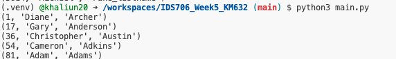
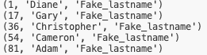

## Working with SQLite

In this lab, I perform CRUD operations on a dataset in SQLite. 

* [C] I create a table named "names" which contains fake random 100 names (cleaned the data) from Faker library
      * In the beginging program drops a table named "names" if it already exists. this ensures that database starts from fresh each time program is run

* [R] Retrieves the all names if the last name starts with A
  Query:
  
  cursor.execute("SELECT * FROM people WHERE lastname LIKE 'A%'")
  results = cursor.fetchall()

    

* [U] Updates the all lastnames starting with A to be "Fake_lastname"
  Query:

  cursor.execute("UPDATE people SET lastname = 'Fake_lastname' WHERE lastname LIKE 'A%'")
  connection.commit()

    

* [D] Delete the 10 last entries from the table once the table has been sorted by lastname in ascending order
  Query:

  cursor.execute("DELETE FROM people ORDER BY lastname ASC LIMIT 10;")
  connection.commit()

# Test

To test the program, I run another database queries where I check if there is any lastname data where the lastname starts with letter A. 
Program passes if there is no such data in the database. 